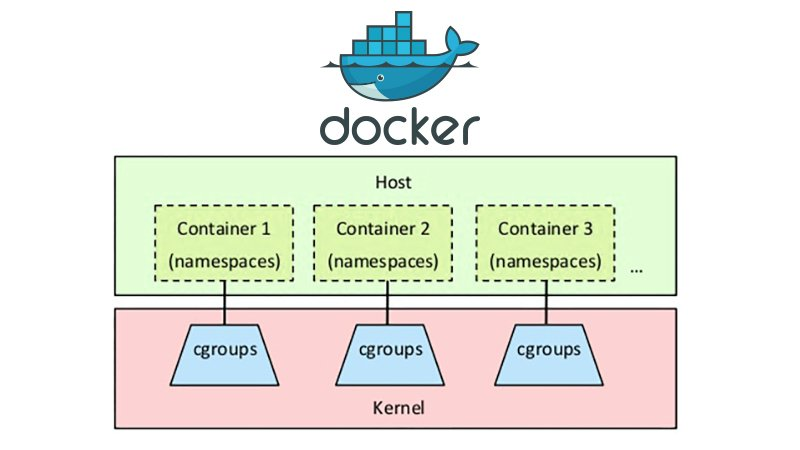

# Docker :whale:


# Primero descargar e instalar Docker

## Que es doker?
1. Simpre el es mismo 
2. Funciona como un Sandbox
3. Facil migrar a diferente hardware



#### Una Imagen de Docker es el conjunto de: 
- Sistema operativo (windows, ubuntu, debian)
- Software (apache, php, nginx, node, python..)
- App (codigo, librerias)


# Dockerfiles
## Instrucciones para crear una imagen
"Las imagenes son para compartir"
~~~
FROM ubuntu

RUN apt-get install apache2

COPY code/ /var/www

CMD ["apache2"]
~~~


### Descargar/Actualizar imagenes de Docker
#### `$ sudo docker pull <imagen:tag>`
De donde descargo imagenes de docker? https://hub.docker.com/
Ejemplo `$ sudo docker pull nginx:latest`


### Corriendo imagenes de Docker (Contenedores)
#### `$ sudo docker run <imagen:tag>`
Al correr una imagen esta se almacena en un contedor
Ejemplo `$ sudo docker run nginx:latest` 


### Comando utiles
- Que imagenes tengo? `$ sudo docker images `
- Que contenedores estan corriendo y han corrido? `$ sudo docker ps ` `$ sudo docker ps -a`
- Detener un contenedor `$ sudo docker stop <CONTAINER ID>`
- Matar un contenedor `$ sudo docker kill <CONTAINER ID>`
- Revivir un contenedor `$ sudo docker start <CONTAINER ID>`
- Ver los logs de un contenedor `$ sudo docker logs <CONTAINER ID>` o  `$ sudo docker logs -f <CONTAINER ID>`
- Ejecutar con comando en un contenedor e iniciar una terminal vivo `$ sudo docker exec -it <CONTAINER ID> <COMANDO>`
- Correr un contenedor en backgorud `$ sudo run -d <CONTAINER ID>`
- Matar todos los contenedores activos ` $ sudo docker kill $(docker ps -q) `


### Nuestro primer Docker file :,( para una app en NodeJS
Nota: Alpine es una distribucion linux muy pequena
- Descarga node:12.22.1-alpine3.11
- Crea el directorio /app y usalor como WORKDIR
- Copia todos los archivos de este directorio al WORKDIR
- Corre ese comando
- Ejecuta en la linea de comandos `node /app/src/index.js`

~~~
//Dockerfile

FROM node:12.22.1-alpine3.11

WORKDIR /app
COPY . .
RUN yarn install --production

CMD ["node", "/app/src/index.js"]
~~~

### Creando nuestra primer imagen
Sintaxis: `sudo docker build -t <NOMBRE DE CONTENEDOR>:<TAG> . `
` sudo docker build -t mi-contenedorcito . `

### Corriendo la imagen
Sintaxis: `sudo docker run -it mi-contenedorcito`


### Enlazando nuestro contendor a un puerto del anfitrion
Sintaxis: `sudo docker run -p <PUERTO ANFITRION>:<PUERTO CONTENEDOR> -it <NOMBRE IMAGEN>`
`sudo docker run -p 1000:3000 -it mi-contenedorcito`


### Volumenes
Estos son bidireccionales
Sintaxis: `docker run -v <DIR LOCAL>:<DIR COTENEDOR> -it <NOMBRE IMAGEN>`
```
sudo docker run -it \
-v /home/julio/Desktop/ApuntesDocker/app/src:/app/src \
-p 1000:3000 \
-it mi-contenedorcito
```

### Volviendo a crear la imagen
`$ sudo docker build -t juliodzalt/mi-contenedorcito:v2 . `

### Renombrar una imagen
`$ sudo docker tag <ID IMAGE> juliodzalt/mi-contenedorcito:v2 `

### Subiendo una imagen a DockerHub
`$ sudo docker login `
`$ sudo docker push juliodzalt/mi-contenedorcito:v2 `


# Docker Compose
Y si queremos administrar varios contenedores al mismo tiempo?

Por ejemplo una app y una base de datos cada uno en un contenedor distinto

## A) Version a mano

### Crear una network en docker
Sintaxis: `docker network create <NOMBRE NETWORK>`

`$ sudo doker network create todo-app-network`

### Ejecutado el contenedor de la bd
~~~

sudo docker run \
--network todo-app-network \
--network-alias mysql-todo \
-v todo-mysql-data:/var/lib/mysql \
-e "MYSQL_ROOT_PASSWORD=root" \
-e "MYSQL_DATABASE=todos" \
-d \
mysql:5.7

~~~

"Algo esta raro no se creo automaticmaente la BD 'todos'"

Entonces la creamos manualemente:

` docker exec -it 1386036a3127 mysql -p `
` Enter password: root`
` mysql> create database todos; `

Y que ip tine la BD internamente? usando este podemos saber xd
` docker run -dp 3000:3000 --network todo-app -e MYSQL_HOST=mysql -e MYSQL_USER=root -e MYSQL_PASSWORD=secret -e MYSQL_DB=todos getting-started:v2 `
` $ docker run -it --network todo-app-network nicolaka/netshoot`

` dig mysql-todo ` R= 172.20.0.2


### Corriendo el contenedor de la app
~~~
docker run -dp 3000:3000 \
--network todo-app-network \
-e MYSQL_HOST=mysql-todo \
-e MYSQL_USER=root \
-e MYSQL_PASSWORD=root \
-e MYSQL_DB=todos \
mi-contenedorcito:v2
~~~


## Pero todo a mano no es muy divertido... :(

## Version Docker Compose

Aqui es cuando llega Docker Compose, este nos ayuda a levantar los contenedores con un solo comando, para esto se utiliza un archivo **docker-compose.yaml** .
Para el caso anterior se debe de crear el siguiente archivo

#### docker-compose.yaml
~~~
version: "3.7"

services:

  app:
    image: mi-contenedorcito:v2
    ports:
      - 3000:3000
    environment:
      MYSQL_HOST: mysql
      MYSQL_USER: root
      MYSQL_PASSWORD: root
      MYSQL_DB: todos
  
  mysql:
    image: mysql:5.7
    volumes:
      - ./todo-mysql-data:/var/lib/mysql
    environment:
      MYSQL_ROOT_PASSWORD: root
      MYSQL_DATABASE: todos
~~~

Entonces docker se encargara de crear una nueva network para cada "composicion" y meter todos esos contenedores en dicha red

Para usarlo levantar todo `docker-compose up -d`

Y se se cae algun contendor? Solo se debe ejcutar `docker-compose up -d` nuevamente y solo levantara a los caidos dejando los activos como estan

